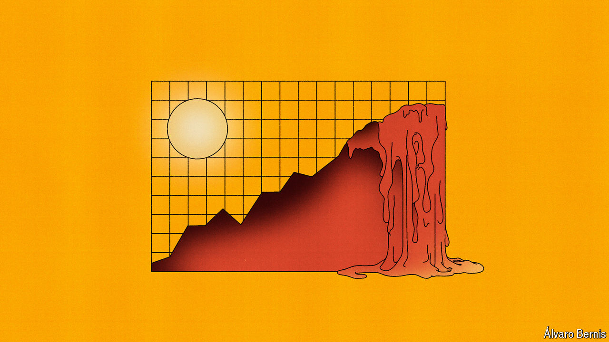

###### Free exchange

# Why any estimate of the cost of climate change will be flawed 

##### Temperature fluctuations are unpredictable. Humans are even more so 

 

> May 30th 2024 

When William Nordhaus, who would later win a Nobel prize in economics, modelled the interaction between the economy and the atmosphere he represented the “damage function”—an estimate of harm done by an extra unit of warming—as a wiggly line. So little was known about the costs of climate change that he called it “terra incognita”, unknown land, compared with the “terra infirma”, shaky ground, of the costs of preventing it. Eventually, a rough calculation gave him an estimate that 1-2% of global GDP would be lost from a 3°C rise in temperature. This was no more than an “informed hunch”, he wrote in 1991. 

A new working paper puts the damage far higher. Diego Känzig of Northwestern University and Adrien Bilal of Harvard University use past changes in temperatures caused by volcanic eruptions, as well as El Niño, a years-long increase in heat released by the Pacific Ocean, to model the impact of a warmer planet. Employing long-term data on global economic growth and average annual temperature, they find that an additional 1°C of warming will lead to a 12% fall in GDP. A climate-change scenario with more than 3°C of warming would be, according to their estimates, an equivalent blow to fighting a permanent war. 

