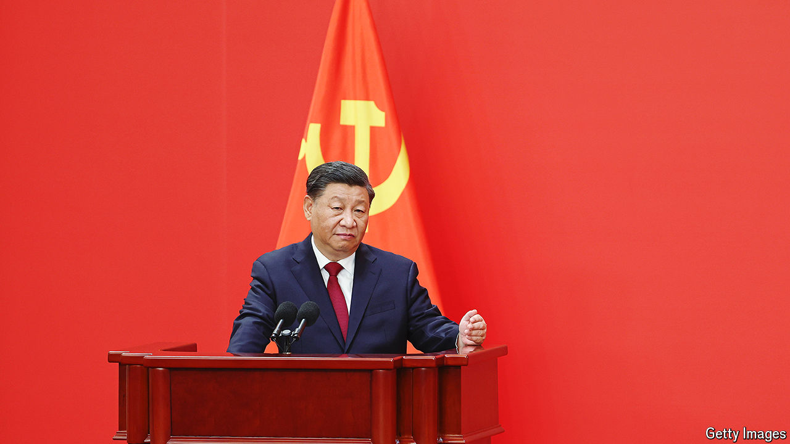

###### Stepping on spiky grass

# Xi Jinping’s surprising new source of economic advice 

##### What China’s leader may learn from a pair of reform-minded academics 

 

> May 30th 2024 

Zhou Qiren is an unusual economist. A professor at Peking University, he spent ten years toiling in the countryside during China’s cultural revolution. “The same farmer”, he observed, “worked like two totally different persons on his private plots versus on collective land.” Unlike most economists, Mr Zhou still studies incentives and constraints from the ground up, starting not with abstract principles, but with concrete cases, often drawn from his travels around China and beyond.

After a visit to a rice-noodle bar in Qinzhen, he wondered why it offered one-week courses showing others how to replicate its prized dish. On trips to China’s sprawling new city districts, he notes that it takes 70 steps to cross the road compared with 15 or so for many streets in Manhattan. He is sceptical of state-owned enterprises, which he once compared to public passages crowded with private “sundries”. He also has doubts about the feasibility of national self-reliance. Prosperity, he has pointed out, is built on “coming and going” across borders. 

