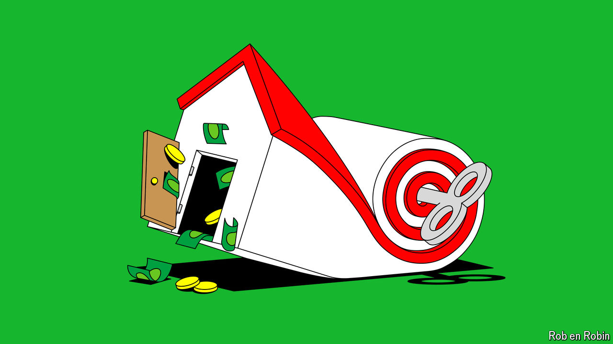

###### Control yourself!

# Is your rent ever going to fall? 

##### Too often politicians tout awful solutions for helping tenants 

 

> May 29th 2024 

An entire generation of tenants is tearing its hair out. Across the rich world—from America to New Zealand—millions spend more than a third of their disposable income on rent. The squeeze extends from social democracies that prize strong tenancy rights to Anglophone countries that prefer homeownership—and it is mostly getting worse. The good news for anxious renters is that they are gaining a louder voice as their numbers swell. The bad news is that campaigners and politicians mostly focus on the wrong kinds of solutions to their woes. 

The 20th century saw an astonishing rise in homeownership. In 1920 about 20% of Britons owned their own home; by 2000, 70% did. Many Anglophone countries followed a similar path. Even in countries less attached to the idea of owning, private renting became less common after a boom in social housing. 

