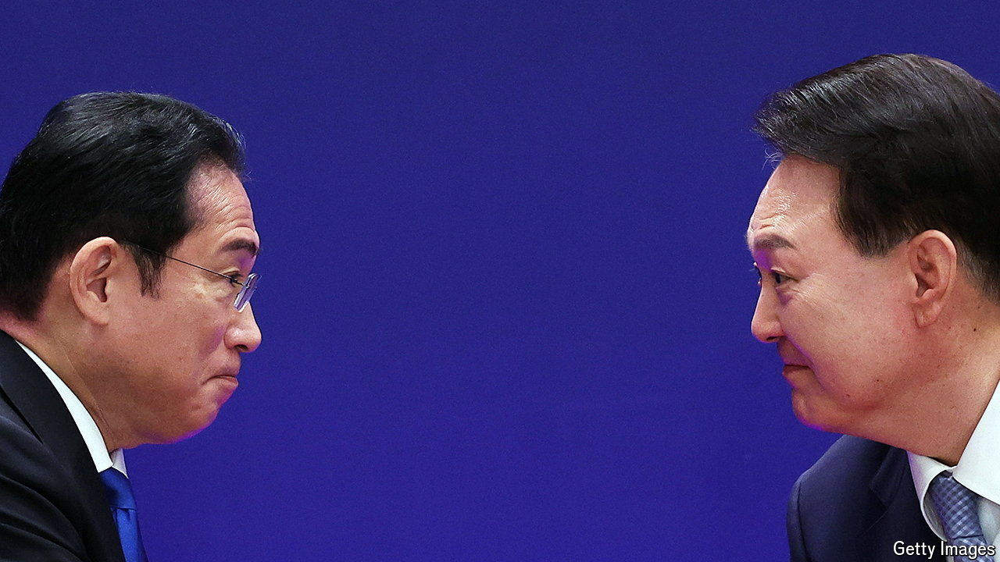

###### Eastern promise

# Japan and South Korea are getting friendlier. At last 

##### As the world economy fragments, two export powerhouses see the virtue of chumminess 

 

> May 30th 2024 

Not long ago, relations between Japan and South Korea were dismal. Between 2018 and 2021 they bickered over compensation for Japan’s abuse of Koreans as forced labourers during the second world war. Tit-for-tat trade curbs and boycotts of goods followed; intelligence-sharing was put at risk. 

Fast forward three years, and things are much friendlier. On May 27th Yoon Suk-yeol, South Korea’s president, and Kishida Fumio, Japan’s prime minister, met Li Qiang, China’s premier, for the first trilateral summit in four years. The two leaders held a similar gabfest with America’s president, Joe Biden, last year, and are due to do so again in July. It helps that Mr Yoon and Mr Kishida get along far better than their predecessors did. But the newfound amity goes beyond personalities. It reflects a growing realisation that, at a time when America and China are turning inward, the two export powerhouses have many interests—and challenges—in common. 

