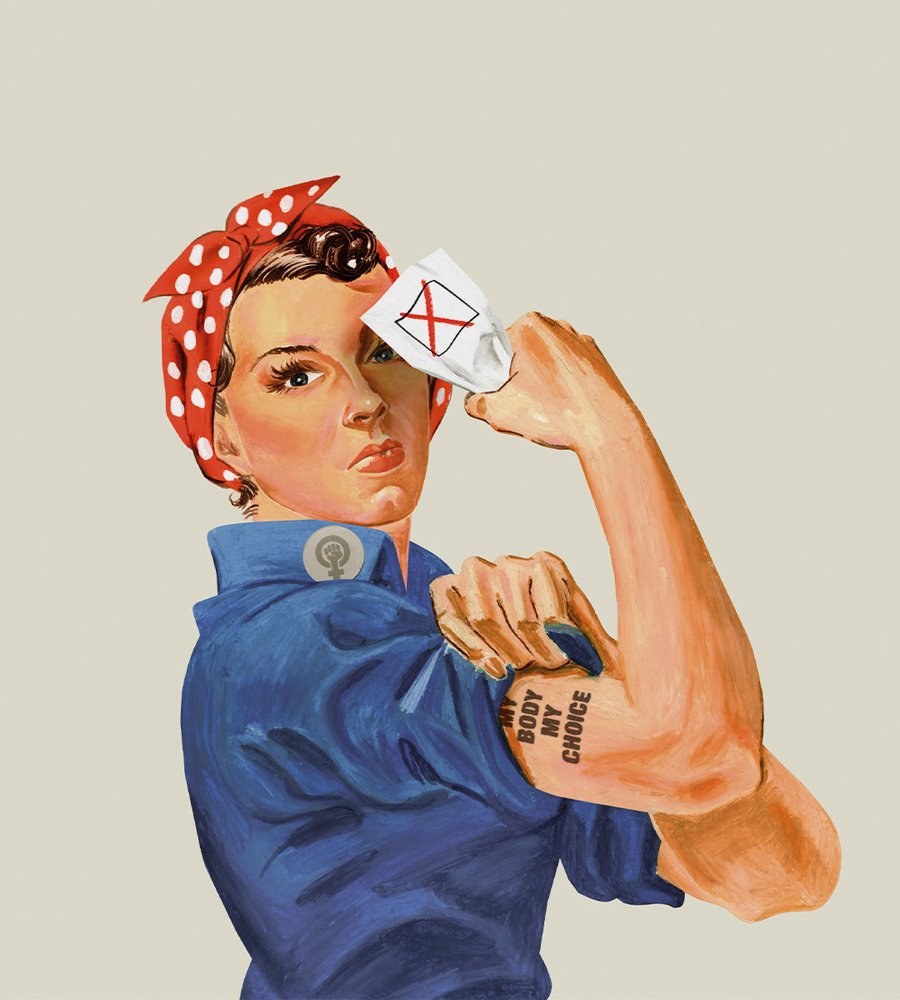

###### Revolt of the reasonable

# The pro-choice movement that could help Joe Biden win 

##### A backlash against abortion bans is energising the middle ground in America 

 

> May 30th 2024 

ABOUT TEN THOUSAND women eligible to vote in this November’s elections were born before women won the right to vote. In the century since then, American women have steadily accumulated rights. In the 1960s the contraceptive pill let women choose how many children they had. In the 1970s no-fault divorce laws and  gave women more choices that had been denied to their mothers. This progress seemed irreversible, and was often taken for granted. Then, two years ago, the Supreme Court overturned , throwing the question of allowing or disallowing abortion back to the states. It turns out that rights can be taken away, too.

A third of American women aged 15-49 now live in states where abortion is either illegal or impossibly restricted. Some states have passed statutes so severe and vaguely drafted that doctors fear they may be forced to choose between risking a patient’s life—in the case of a dangerous miscarriage or complicated pregnancy—and risking breaking the law. 

