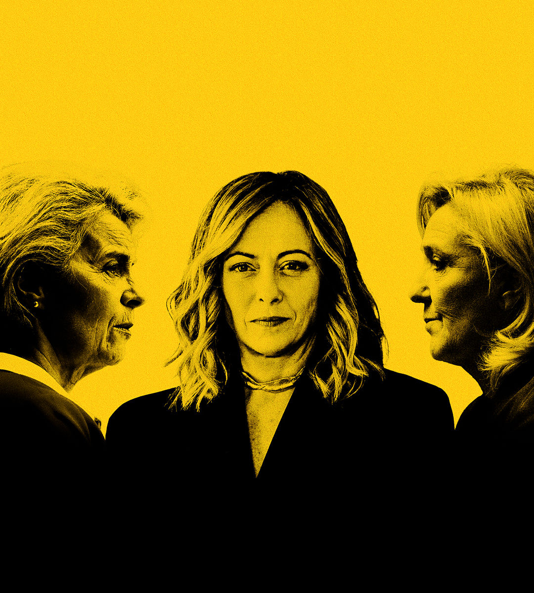

###### Von der Leyen, Meloni and Le Pen

# The three women who will shape Europe 

##### At a crucial moment they encapsulate the dilemma of how to handle populism 

 

> May 30th 2024 

In a dangerous world, comfortable old Europe finds itself in an alarming position. In Ukraine the continent’s bloodiest war since 1945 rages on, while Russia poses a menace from the Baltics to cyberspace. If Donald Trump returns to the White House, he could undermine nato, the foundation of European security. The continent’s economy is vulnerable to shocks caused by industrial policy and protectionism elsewhere. Eurosceptic populists are riding high in the polls. 

To face these perils Europe needs, at a minimum, coherent leadership at the eu level. It also needs to keep extremists out of power. Whether it succeeds rests in part on the choices of three women: Ursula von der Leyen, the president of the European Commission, Giorgia Meloni, Italy’s prime minister, and Marine Le Pen, the leading French populist. 

