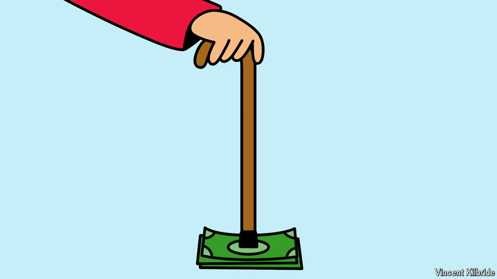

###### Prudent pensioners, profligate politicians

# What penny-pinching baby-boomers mean for the world economy 

##### They are saving like never before. But even that may not bring interest rates down 

 

> May 30th 2024 

THE WEST’S baby-boomers are the richest generation ever to have lived—but they do not spend like it. Instead, as we , the elderly are squirrelling away money, motivated by ever-longer retirements, the risk that they will need to pay for old-age care, the inevitable uncertainty about how long they will survive and the desire to pass on assets to their children (see Finance &amp; economics section). Whereas in the mid-1990s Americans aged between 65 and 74 spent 10% more than their income, the same age group has been a net saver, in aggregate, since 2015. A similar picture is found across the rich world, from Canada to Japan. A generation sometimes associated with luxury cruises and Château Margaux is in fact unusually miserly. 

That matters because retirees are so numerous and rich that their behaviour can drive capital markets. America’s boomers, defined as those born between 1946 and 1964, have a net worth of $76trn, or over $1m per person. For decades their saving for retirement has helped drive down interest rates, which in the long run must move to equilibrate savings and investment globally. But economists had speculated that, upon reaching the end of their careers, boomers would open their wallets, causing this trend to reverse. Some even worried that retirees liquidating assets en masse in order to splurge could cause an asset-market meltdown. 

