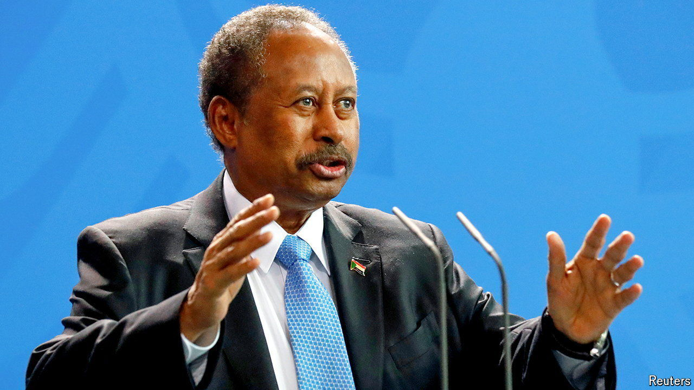

###### Give peace a chance

# A Sudanese gathering outside the country proposes a third way 

##### But the main armed forces men may still end up in charge 

 

> May 30th 2024 

A glimmer of hope was provided this week by ordinary Sudanese civilians rather than the two armed forces battling for supremacy on the ground. On May 27th, to the sound of joyous ululations, the “Co-ordination Body of the Democratic Civil Forces of Sudan”, more snappily known as Tagadom, began a four-day convention in Addis Ababa, the capital of Ethiopia. Chaired by Abdalla Hamdok, Sudan’s last civilian prime minister, Tagadom seeks to rally as wide a coalition of Sudanese as possible to stop the civil war and return the country to civilian rule.

Given the chaos and terror that now prevail, it was a small logistical miracle that the organisers managed to gather 600 or so Sudanese delegates under one roof. Previous such meetings of groups claiming to represent Sudan’s people have been criticised for merely assembling the usual elites to stand up for little more than their own selfish interests. So Mr Hamdok’s team went to enormous lengths to embrace the broadest spectrum of Sudanese oufits, based both at home and abroad.

