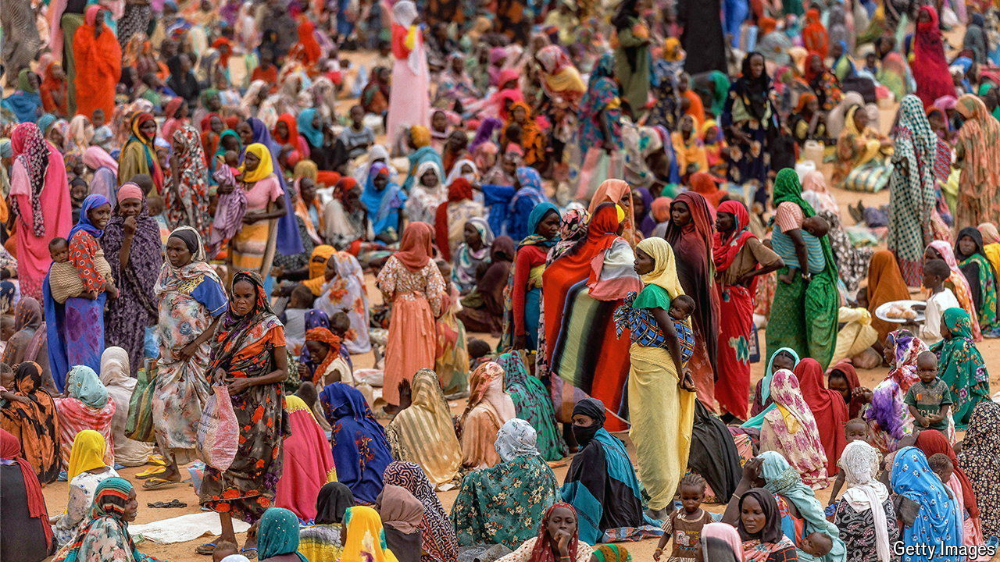

###### Last stand in Darfur

# A battle rages for a key city in Sudan’s ravaged western region 

##### The civil war’s outcome may be affected by it 

 

> May 30th 2024 

For more than a year after civil war began in Sudan, el-Fasher held out. City after city in Darfur, a vast western region of which it is the capital, fell to the Rapid Support Forces (RSF), a paramilitary group fighting to take over all of Sudan. But el-Fasher remained an island of relative stability. Tens of thousands of people fleeing ethnic cleansing and possible genocide elsewhere joined the hundreds of thousands who had settled in the city during the previous Darfur war 20 years ago. While much of Sudan has collapsed into chaos, el-Fasher maintained a fragile peace.

Until now. On May 10th a local truce struck early in the war fell apart. Violence in and around Darfur’s capital has soared. The city’s eastern side is under fiercest assault, according to open-source-intelligence analysts at Yale University’s Humanitarian Research Lab. Repeated shelling of a camp for displaced people has forced almost half of them to flee. “Missiles every day,” reports a nearby resident by text message. A clinic in the city’s south, which has only one surgeon left, has taken in more than 1,000 wounded patients, says Jérôme Tubiana of Médecins Sans Frontières, a charity. At least 134 have died.

