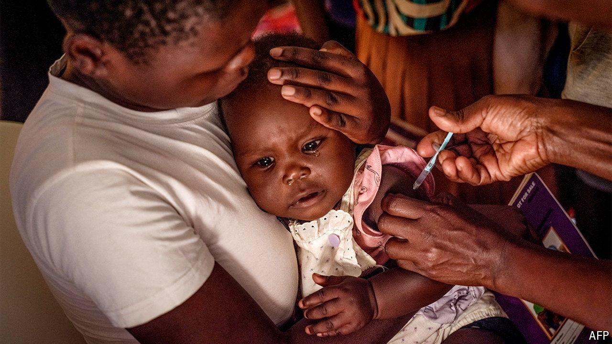

###### Buzz kill

# New fronts are opening in the war against malaria 

##### After years of stalemate, ground-breaking vaccines and better nets are raising hopes 

 

> May 30th 2024 

In the shade of a tree outside a clinic in Wakiso near Kampala, Uganda’s capital, Hadijah Mirembe watches over her nine-month-old son. She has been here for two days, ever since his temperature soared. He has malaria, she explains, as his chest rises and falls rapidly in his sleep. So does she. These days, even when she sleeps under a net, she often wakes to find a satisfied mosquito that has snuck inside. 

Millions of parents in Africa know the worry of caring for a child with malaria. Many know the grief of losing one. But two new vaccines give hope. The first, rts,s/as01, has been tried on nearly 2m children in Kenya, Ghana and Malawi since 2019, and is being used in seven more countries this year. The second, r21/Matrix-m, which is being made in larger volumes at less than half the price, started shipping on May 24th to the Central African Republic.

