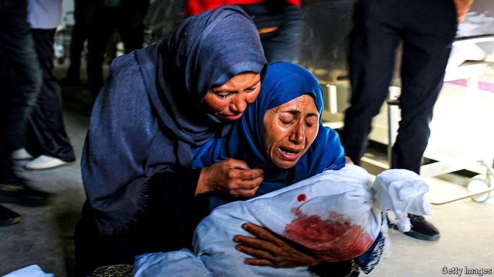

###### Horrors in Rafah

# Outrage at a strike in Rafah is unlikely to change policy 

##### America has already said the incident does not cross its red lines 

 

> May 29th 2024 

Only one detail of the events of the night of May 26th is undisputed: dozens of people were killed in an Israeli air strike in Rafah. Palestinians say that several large bombs were used to target a camp of civilians, uprooted from other parts of war-torn Gaza. The Israel Defence Forces (idf) acknowledge there was a strike but claim they used two smaller missiles to target two senior Hamas men who were killed. The additional deaths, they insist, were caused by secondary explosions—a vehicle carrying explosives or a fuel truck—that they had not foreseen.

There is disagreement as well over the status of the attacked area. According to the Palestinians, it was a designated “humanitarian zone”. The idf insists that the  is elsewhere, but accepts that the area that was hit is not included in a list of locations in Rafah that it had ordered civilians to evacuate. 

