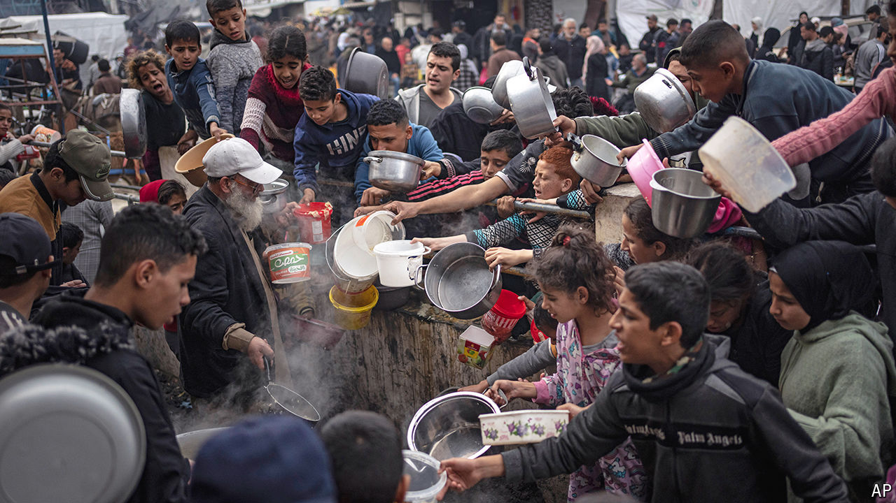

###### Occupation and responsibility

# Who is responsible for feeding Gaza? 

##### Arguments fly over Israel’s duty to maintain aid 

 

> May 29th 2024 

An estimated 1m Palestinians have fled Rafah since the start of Israel’s offensive there on May 6th. For those who remain, the fighting has had grisly consequences. At least 45 people, including a number of children, died on May 26th after an ; survivors had to pull charred bodies from the wreckage. Even those who evacuated are not entirely safe: dozens more were killed two days later in a strike near al-Mawasi, a so-called “humanitarian zone” for displaced civilians.

Less macabre, but just as consequential, is what the offensive has done to the flows of aid that have kept 2.2m Palestinians alive throughout eight months of war. Consider the statistics from one recent day. The Israeli army said that 370 lorries of aid reached Gaza on May 27th, 154 of them via Kerem Shalom, a border crossing in the south. Yet the un’s official tally from that day recorded zero lorries at Kerem Shalom. Neither side is lying—nor, though, are they telling the whole truth. The confusing figures show how Israel’s campaign in Rafah has complicated deliveries of aid.

