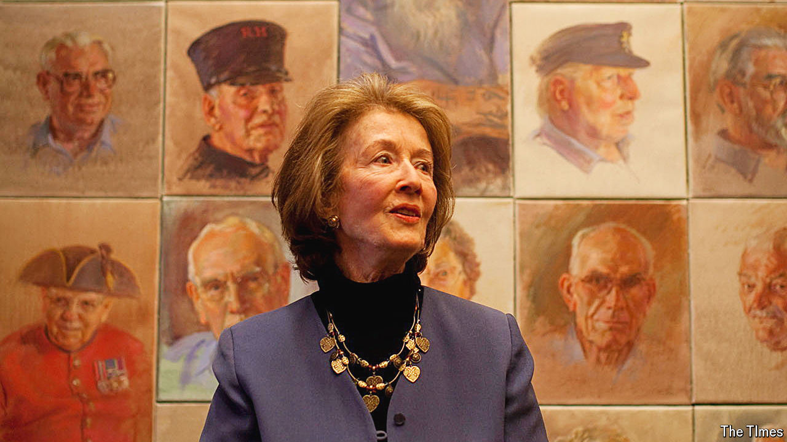

###### Fixing a likeness

# June Mendoza captured both the famous and the unknown 

##### Britain’s most prolific portrait-painter died on May 15th, aged 99 

 

> May 29th 2024 

The moment she set eyes on him, June Mendoza knew he would be ideal. She was busy painting four presidents of the Royal Society of Engineering when his face appeared at the window. A nice face, plump and cheery, with brawny shoulders under a purple t-shirt. He was hard at work too, expertly fixing scaffolding with a twist of the tool that swung cheekily at his groin. When the engineers had left, she went to the window and asked if he would sit for her. He agreed at once. 

Her career, as Britain’s most-called-on portrait-painter, was to encompass most of the grandees of the land. The list began with royals: three Prince Philips, two Annes, three Charleses, two Dianas, five queens. She got very good at painting pearls. (The queen’s face, though, was not easy, soft rather than sharp.) After these came archbishops, generals, prime ministers, eminent musicians, famous sports personalities, captains of industry and entertainers. But generously mixed in with these—perhaps a third of her productions—were her “pick-ups”. She spotted them across restaurants, at the theatre, in shops, and would boldly ask if she could paint them. All were surprised, but almost all went along with the novel experience of watching this small, slim woman darting back and forth from her unwieldy old easel, chatting. 

