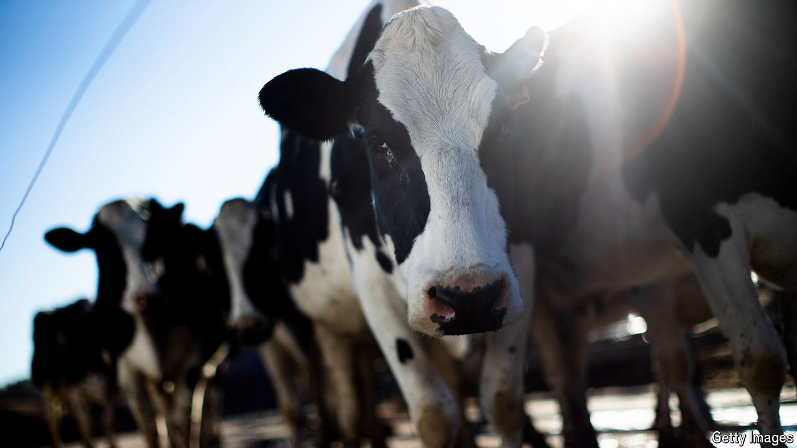

###### Avian flu

# A second human case of bird flu in America is raising alarm 

##### How close is the H5N1 outbreak to becoming the next pandemic? 

 

> May 24th 2024 

On May 22nd America’s Centres for Disease Control and Prevention confirmed a new human infection with the H5 avian influenza virus, a bug with pandemic potential that has recently spread rapidly among dairy cows in America. This is the second identified human case linked to the cow outbreak. Both are farm workers who probably got infected through contact with infected animals and had only mild symptoms. Although there is no evidence yet of human-to-human transmission, America’s public health authorities are on high alert. Half of the national pandemic stockpile of H5N1 vaccine is being made ready to deploy.

Influenza viruses infect many species and, every now and then, a virus will cross over and infect a species that is not its speciality. When that happens, it could be highly lethal for the new host species. H5N1, an avian influenza virus that has now crossed over into numerous bird and some mammalian species, is one of those with pandemic potential because there is no immunity to it in humans. In the nearly three decades since H5N1 was first detected in geese in China, there have been around 900 known human infections worldwide, usually from contact with infected poultry or other birds. Nearly half of these were fatal. Still, mild or asymptomatic infections would have gone undetected, making the fatality rate lower. 

