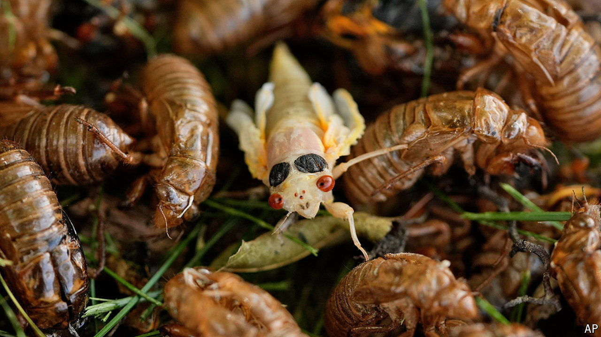

###### Flying bugs

# Hordes of cicadas are emerging simultaneously in America 

##### The ancestors of these two neighbouring broods last met in 1803 

 

> May 28th 2024 

All across the eastern states of America, it is cicada season. These small winged insects roughly the size of a paperclip emerge at regular intervals in vast hordes known as broods, many millions or billions of individuals strong. They spend a few frantic weeks breeding before the females lay eggs in slits carved into tree branches. When these hatch, around six weeks later, the juveniles head underground to find a root into which they can plunge their feeding tubes. Many years later, the cycle repeats.

Fifteen such broods of the genus  exist in North America. Some, like Brood VII in New York and Brood XIII in the Midwest, live on a 17-year cycle. Others, like Brood XXII in the South, emerge every 13 years. This year, for the first time this century, two broods with contiguous territory are emerging simultaneously. The exact number of insects expected to fill the air from Georgia to Wisconsin, though disputed, is high. “Maybe a trillion’s not out of the question,” says John Lill at George Washington University. “It’s going to be pretty extraordinary.”

