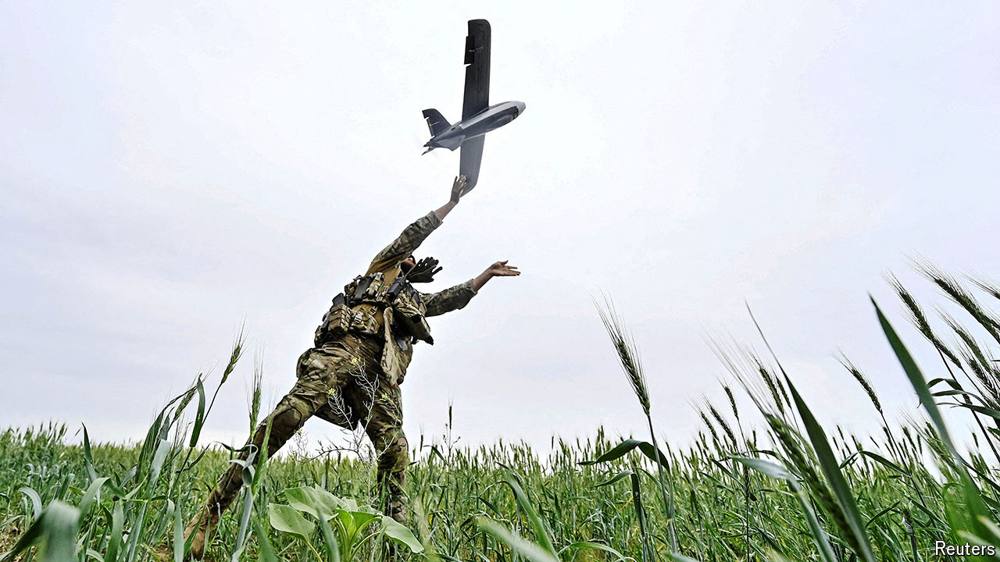

###### Drone warfare

# Many Ukrainian drones have been disabled by Russian jamming 

##### Their latest models navigate by sight alone 

 

> May 29th 2024 

AS UKRAINE’S STOCKS of artillery shells have dwindled, its army’s reliance on drones has grown. These are able to deliver ammunition with great precision over long distances—provided they can maintain connections with GPS satellites (so they know where they are) and their operators (so they know what to do). Such communication signals can be jammed, however, and Russia’s electronic warfare, as signals scrambling is known, is fearsomely effective. With large numbers of its drones in effect blinded, Ukraine’s drone technologists have been forced to get creative.

Enter Eagle Eyes, a remarkable software package for drones. Developed by Ukraine’s special forces, it allows drones to navigate by machine sight alone, with no need for outside input. Using artificial-intelligence (AI) algorithms, the software compares live video of the terrain below with an on-board map stitched together from photographs and video previously collected by reconnaissance aircraft. This allows for drones to continue with their missions even after being jammed.

