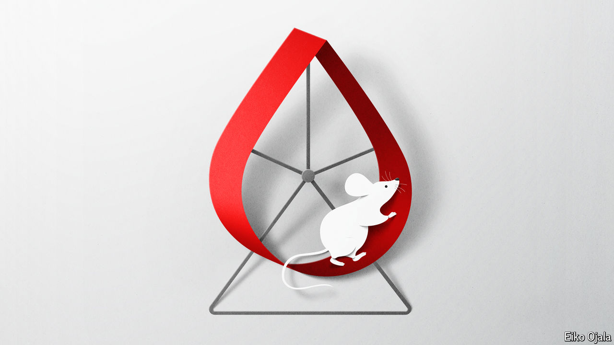

###### Of mice and menses

# Progress on the science of menstruation—at last 

##### Newly developed research models show promise 

 

> May 29th 2024 

HISTORY OFFERS no shortage of unhinged takes on menstruation. In 77AD, Pliny the Elder claimed that contact with menstrual blood would turn crops barren and drive dogs mad. A medieval medical text warned that the presence of menstruating women would make men ill, and that sex with them would cause cancer of the penis. In the first half of the 20th century, some theorised that periods contained toxins that could wilt flowers.

Such thinking is, obviously, misogynistic nonsense. But menstruation, though not unnatural, is certainly unusual. Humans are among the very small proportion of creatures capable of the feat. That, coupled with the fact that scientists have historically shied away from studying menstruation, has made it far harder to understand the problems that can come with periods, or to develop treatments for them. Fortunately, researchers are now developing a suite of new tools to do just that. 

