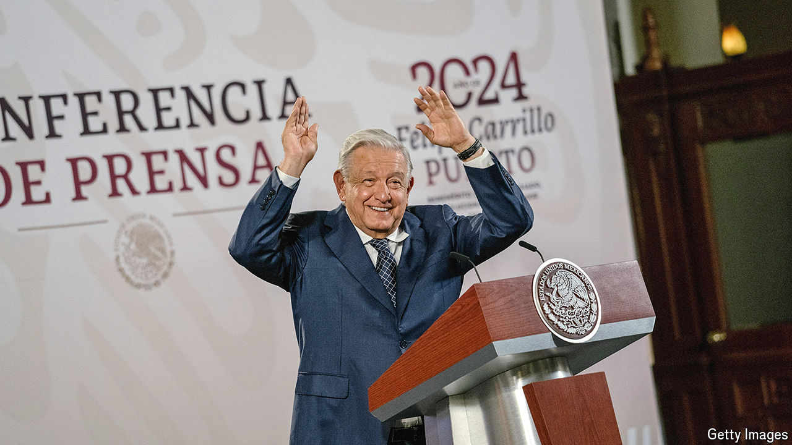

###### Influencer and president

# Andrés Manuel López Obrador’s mañaneras have boosted his presidency 

##### They are a marvel of populist communication 

 

> May 30th 2024 

Self-respecting populists speak to the people directly. Few have mastered the art like Andrés Manuel López Obrador, Mexico’s outgoing 70-year-old president. Every weekday morning at 7am begins his a several-hour-long broadcast from wherever he is that day, often the National Palace. Broadcast on YouTube, as well as radio stations and a podcast, each reaches an average audience of 10m. 

Mr López Obrador says the purpose of the broadcast is transparency. But most of the time he uses it to laud supposed achievements, pillory critics and, most often, to ramble—the longest  to date ran for three hours, thirty-five minutes and five seconds. His enemies (“neoliberals”, “puppets”, “conservatives”) include journalists, the electoral body and female protesters. Mr López Obrador has used the show to reveal the apparent salary of a prominent anti-corruption campaigner and the phone number of a journalist. He has broken electoral laws, too. 

