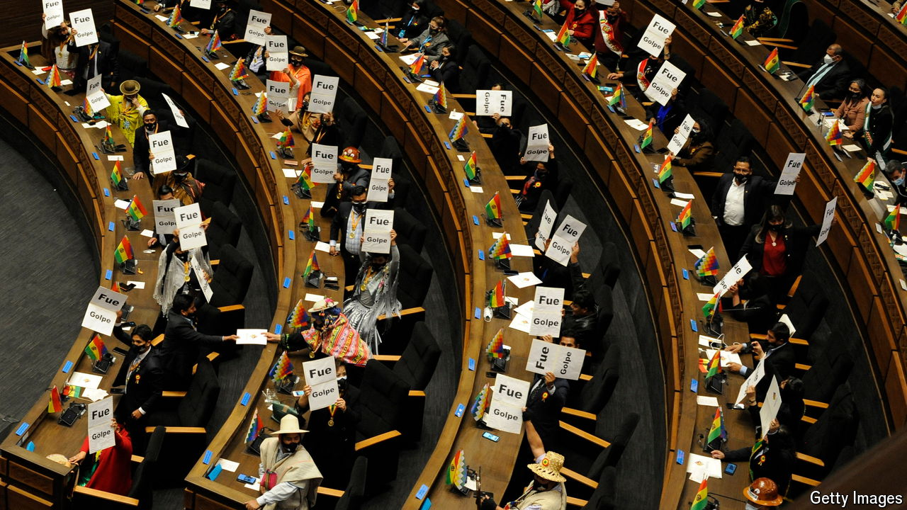

###### Double trouble

# Bolivia’s left wing is at war with itself 

##### The feud is preventing the government from addressing a looming economic crisis 

 

> May 30th 2024 

Meetings of the Movimiento al Socialismo (MAS) used to be soporific affairs. Not any more. These days they erupt into brawls, with bottles and chairs soaring over the mêlée, before they are broken up with tear gas.

The change reflects a rift at the top of Bolivia’s governing party, where President Luis Arce and Evo Morales, a former holder of the post, are fighting to lead the MAS into next year’s elections. It has paralysed the government, split the indigenous and labour groups that form the party’s base, and offered the opposition its first sniff of real power in almost 20 years.

