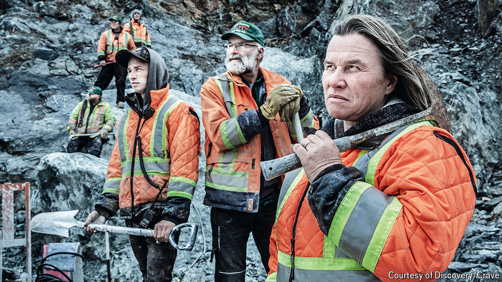

###### Jaded nation

# Canada’s jade mines boomed on Chinese demand. Now that’s over 

##### Local indigenous groups are happy that jade mines will no longer scar their lands 

 

> May 30th 2024 

In 2008 Jade West, a small Canadian mining company, was selling nephrite jade for $20 per kilo. Then the Chinese market woke up. The Chinese government ran a campaign to promote nephrite jade during the Beijing Olympics, sparking interest in the gemstone from Chinese consumers. The price surged to between $200 and $2,000 a kilo, depending on quality. 

Now jade prices have crashed back down to earth. In May the government of British Columbia ordered all jade mining in the north-west part of the province to cease within five years. The Tahltan Nation, an indigenous group whose territory covers rich seams of mineral deposits in British Columbia, had long lobbied for this due to environmental concerns. Softening demand and meagre tax revenues made the decision an easy one. Miners are upset. “My legacy has certainly been tarnished at this moment by this decision,” says Jade West’s founder, Kirk Makepeace.

