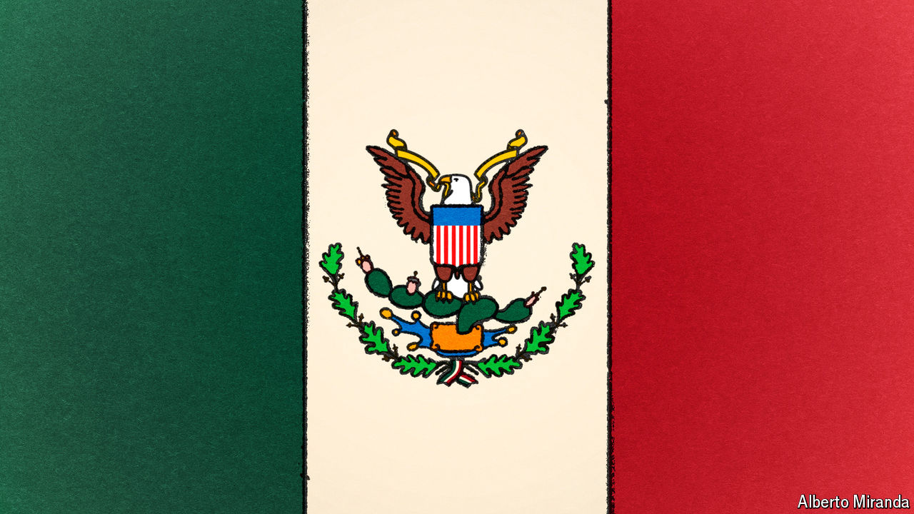

###### Mexico’s moment

# Mexico’s next president can reset relations with the United States 

##### She will have much work to do on drug-trafficking, security, migration and trade 

 

> May 27th 2024 

Mexicans elected Andrés Manuel López Obrador president in 2018 for sound reasons: his diagnosis that inequality, insecurity and a corrupt political class were damaging Mexico was convincing. But apart from poverty-reducing minimum-wage increases, Mr López Obrador’s “Fourth Transformation” has taken Mexico backwards. A statist, bent on tearing down the works of his predecessors, he is leaving the health-care and education systems in tatters. His reversal of pro-competition energy-market reforms has made Mexico’s electricity dirty and costly. Water is scarce. His hands-off security policy has let criminal groups strengthen their grip. He has attacked independent institutions, from the electoral body to the Supreme Court. In part because of his animus towards the private sector, the economic growth rate has been on average 2-3% per year in the non-pandemic years of his presidency—a mediocre figure given the huge opportunity facing Mexico—and momentum has slowed in the past six months. 

Mexicans will decide who inherits this mess when they elect a new president on June 2nd. They are likely to choose Mr López Obrador’s protégée, Claudia Sheinbaum, who belongs to Morena, the ruling party. Her rival, Xóchitl Gálvez, who represents a coalition of older parties, is polling about 20 points behind. How the winner governs will matter not just for Mexicans suffering from violence and inequality, but also for the rest of the world. Mexico has become a crucial actor in the shifting global order. The number of migrants travelling through Mexico to the United States has surged, and illegal migration may currently be the biggest political issue in the world’s most powerful country. The West looks to Mexico to help it , especially for manufacturing vital electronics and green technologies. Mexico’s next president will have great influence on both counts.

