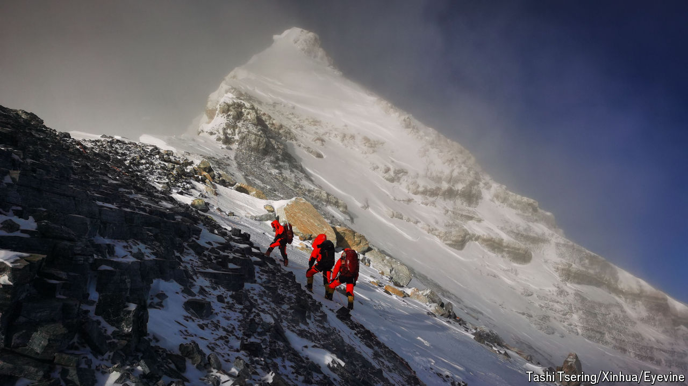

###### The Economist reads

# Five of the best books on climbing mountains 

##### The books and a documentary that capture the pull of the peaks 

 

> May 24th 2024 

MOUNTAINEERING HAS gone mainstream. What was once a pursuit for only the hardiest adventurers is now the extreme sport . Take . In the four decades after Sir Edmund Hillary and Tenzing Norgay first reached the summit in 1953 an average of 12 people a year followed in their footsteps. In 2023 more than 1,200 people attempted the climb; 655 reached the summit and 18 died trying. The ascent of Everest is now an industry: for between $35,000 and $110,000 guides will take novices to the top of the world. But the new commercialism should not detract from the romance of mountaineering. These five books and a documentary allow armchair alpinists to experience a bit of the thrill with none of the peril. 

By Fergus Fleming. 

