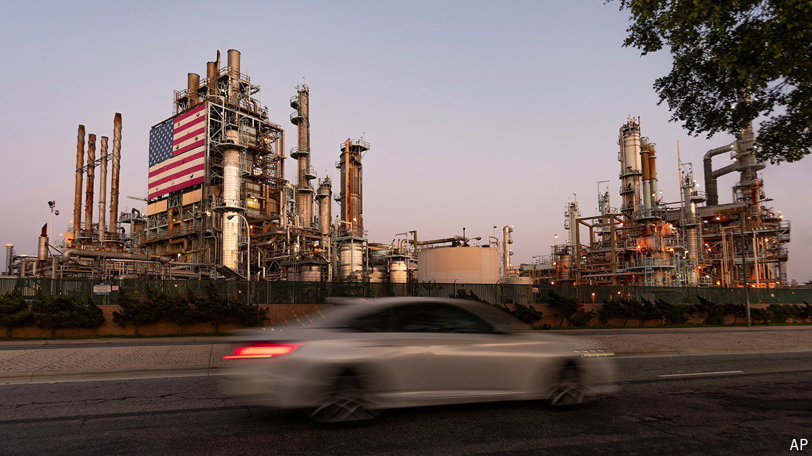

###### The world this week

# Business 

#####  

 

> May 30th 2024 

 agreed to buy  in a deal they valued at $22.5bn, making it the latest energy mega-merger in America. Oil and gas companies are consolidating in order to cut costs and boost their footprints. Marathon owns assets in Eagle Ford in Texas, Bakken in North Dakota, Permian in New Mexico and Texas, and in Oklahoma. 

Shareholders in , an energy exploration company, approved a controversial $53bn takeover by . Hess holds a 30% stake in a big oilfield project off the coast of Guyana. Chevron’s offer has been challenged by ExxonMobil, which owns a 45% stake in the Guyana project and claims it has the right to negotiate with Hess about the asset. ExxonMobil has started an arbitration process. ISS, a proxy-advice firm, had recommended that shareholders abstain from voting while arbitration was ongoing. 

