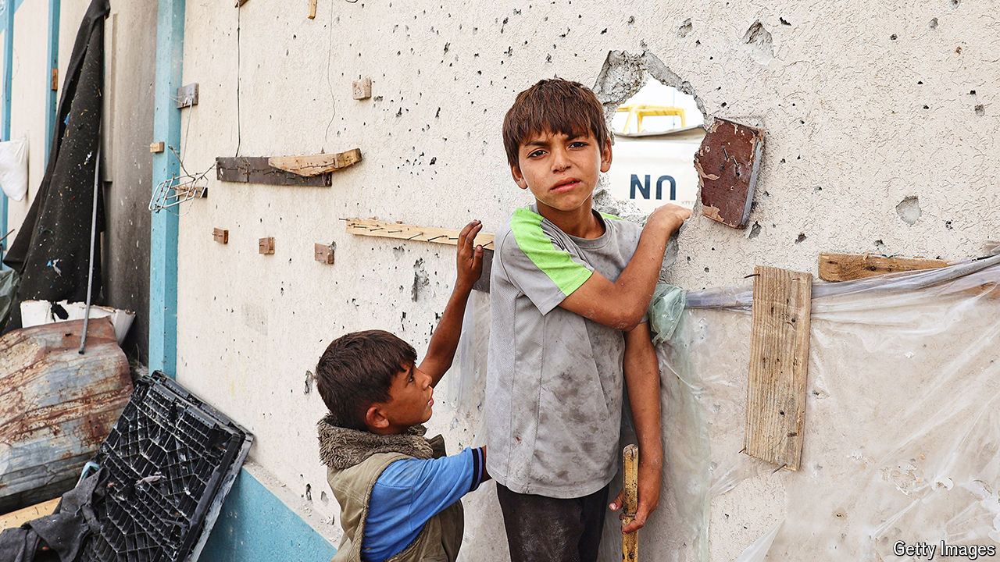

###### The world this week

# Politics 

#####  

 

> May 30th 2024 

At least 45 people were killed in  after an Israeli air strike hit a tent camp. Israel said it was targeting two Hamas commanders and that the other deaths were caused by secondary explosions. Palestinians claimed large bombs hit an area for displaced people. America said Israel’s actions did not cross the administration’s red lines and would not trigger a change in policy. Meanwhile, Hamas launched a rocket attack on central Israel, including Tel Aviv, for the first time in months.

The International Court of Justice to limit its military offensive in Rafah and cease any operations that may cause widespread civilian deaths and suffering. 

