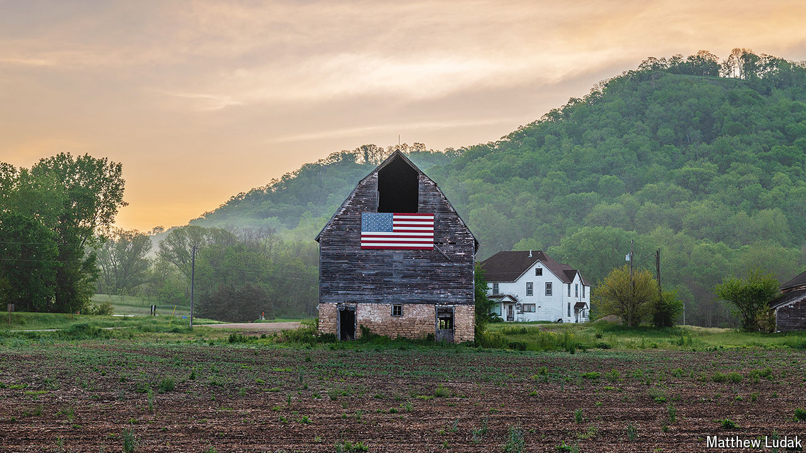

###### Gone with the wind

# A tornado destroys a barn—an Economist favourite—in Wisconsin 

##### We had only just used its image on a story about America’s rural voters 

 

> May 30th 2024 

 we illustrated our story on rural voters with this picture of a barn near Cochrane, in western Wisconsin. Sadly, the barn is no more. On May 21st a number of tornadoes touched down in the state. One of them razed the roughly 100-year-old barn to the ground. Although tornadoes are a familiar hazard, the barn was extremely unlucky. In an average year Wisconsin, which is almost as big as Austria and Hungary combined, can expect to have about 23 tornadoes, according to the National Weather Service. The state’s tornado season normally runs from April to September, though this year for the first time it recorded one in February. ■


