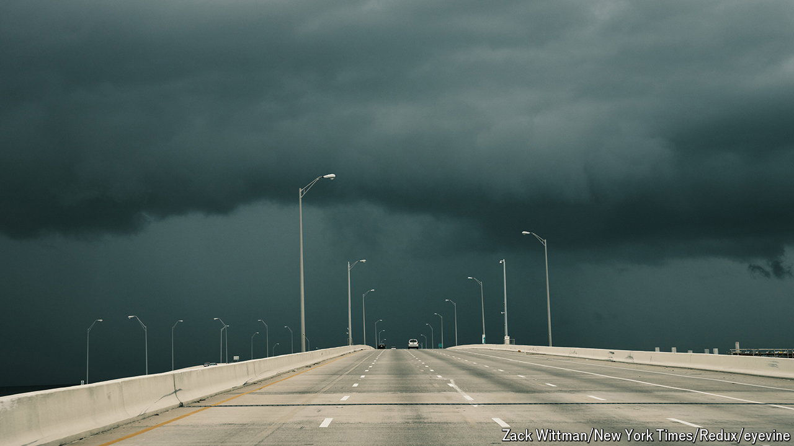

###### Be prepared

# America could face its most active hurricane season ever 

##### Coastal states must brace themselves for extreme weather in an election year 

 

> May 30th 2024 

DANIELLA LEVINE CAVA, the mayor of Miami-Dade County in Florida, approaches the microphone. “It’s that time of year,” she says, smiling knowingly. She could have been referring to the end of the school year, the beginning of America’s general-election campaign or the premiere of the new season of “The Kardashians”. In fact, Ms Levine Cava was talking about hurricane season, which begins on June 1st, and is expected to be the most active one America has ever experienced. 

The National Oceanic and Atmospheric Administration (NOAA) is predicting between 17 and 25 named storms, of which eight to 13 are expected to be hurricanes and four to seven “major hurricanes” with winds of 111mph (179kph) or higher. That compares with an average of 14 named storms and three major hurricanes between 1991 and 2020. This is the most storms the agency has ever forecast when giving its predictions in May. Other leading forecasters have come to similar conclusions. Weather and emergency-management officials repeated one phrase like a mantra: “be prepared”. 

