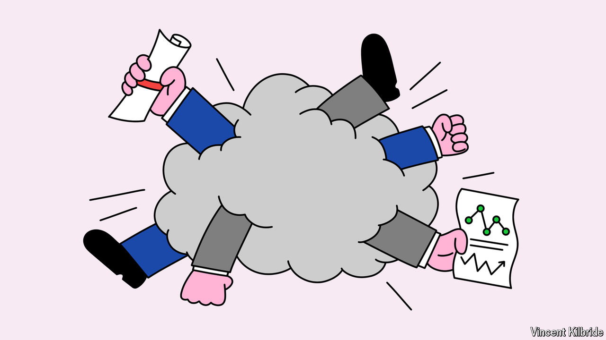

###### Budget-modelling wars

# Fiscal nerds determine the fate of legislation in America 

##### A battle under way to remake budget scoring 

 

> May 30th 2024 

James Carville’s oft-quoted line needs updating. Bill Clinton’s political adviser once quipped that he would like to be reincarnated as the bond market so that he could “intimidate everybody”. It is now a group of fiscal nerds—called budget scorekeepers—who have more clout in determining the fate of American legislation. This has set the stage for a battle about how best to calculate the costs and benefits of tax and spending proposals.

Officially, two scorekeepers matter. The Congressional Budget Office (CBO) gauges the impact of nearly all federal bills, from minimum-wage increases to health-insurance reforms. The Joint Committee on Taxation (JCT) focuses on tax changes. Both are non-partisan, and their conclusions can make or break legislation by showing whether it is good value.

