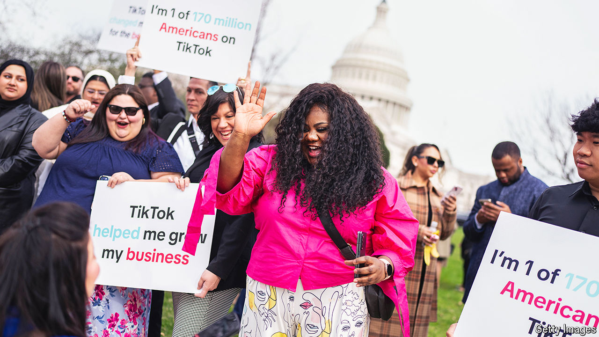

###### No joke

# The side-effects of the TikTok tussle 

##### As the app’s future hangs in the balance, the ramifications of the battle are becoming clearer 

 

> May 30th 2024 

JOE BIDEN’S re-election campaign wants you to know that the president is funny. To prove it, examples of his hilarity are posted almost daily to his TikTok page. One video, peppered with fire emojis, shows him cracking jokes about Donald Trump. Viewers have their own gag: isn’t he trying to ban this app? 

The government says it is not banning TikTok but has given it an : sell to a suitable non-Chinese owner by January or shut down. It deems TikTok, which is owned by ByteDance, a Chinese firm, to be controlled by a “foreign adversary” and to be a national-security threat. Politicians accuse China of using TikTok to steal Americans’ data and spread propaganda. 

