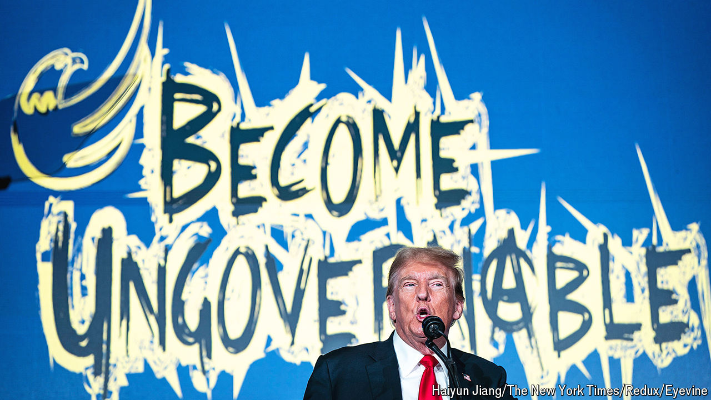

###### The 3% party

# What are America’s Libertarians for? 

##### They are grappling with whether to go for national influence or local wins 

 

> May 28th 2024 

Donald Trump should have seen it coming. He arrived on May 25th at the Libertarian Party’s national convention in Washington, DC, hoping to expand his support, but the crowd mostly responded with boos. Attendees lacked enthusiasm for a protectionist who added $8.4trn to . They also spent the weekend squabbling among themselves. After losing presidential races for more than half a century, the Libertarian Party is facing an identity crisis.

Libertarians share a baseline belief that the state best serves the people by leaving them alone. Yet for a party that peaked at 3.3% of the popular vote in 2016 it harbours a striking amount of intellectual diversity. Convention attendees could join the Bitcoin Caucus (“Got inflation?”) or the Emo Caucus (“Live Free or Cry”). A pair from the Pro Life Libertarian Caucus wore Make Argentina Great Again hats, a nod to , the country’s libertarian president. One booth advertised a tantalising, if dubious, proposition: “Opting out of income tax. It’s not just for millionaires.” 

