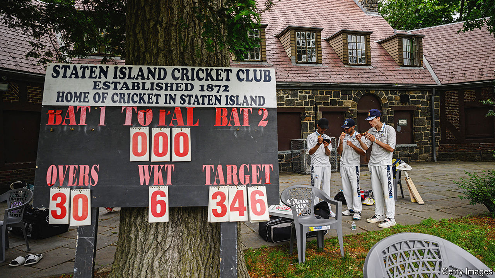

###### Howzat meets fuhgeddaboudit

# Will Americans be bowled over by cricket—again? 

##### Boosters have high hopes for the sport as America co-hosts the T20 World Cup 

 

> May 30th 2024 

“BASEBALL is fun, but not as fun as cricket,” says Ansh Patel, an 11-year old from Long Island, next to New York City. He attends Queens United Cricket Academy (QUCA), a training programme for the sport. His father, originally from India, is pleased as punch. “He’s fulfilling my dream.” 

Ansh’s friends play American football, soccer and baseball. He is cricket-mad. He can’t wait for the , featuring a shorter, action-packed version of the game, which begins on June 1st. It is co-hosted by America and the West Indies. Most Americans don’t have a clue what a silly-mid-off is, never mind a yorker. 

