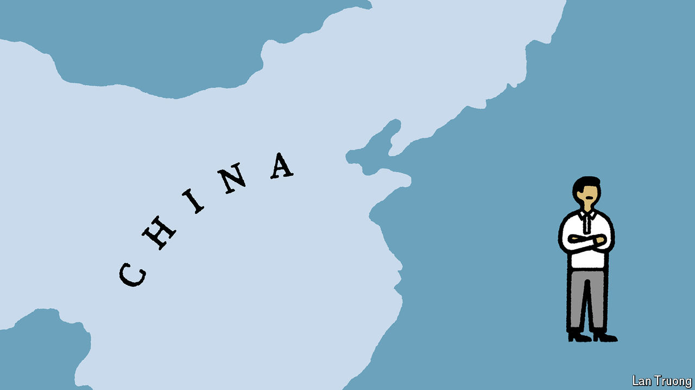

###### Banyan

# How the Philippines is turning the water-cannon on China 

##### Ferdinand Marcos’s flip is a huge gift to America. But dangers lie ahead 

 

> Jun 6th 2024 

“TRANSFORMATIVE”, “historic”, “eloquent”: such are the compliments which American officials these days shower on Ferdinand Marcos, the Philippines’ president. After a six-year dalliance with China by his predecessor, Rodrigo Duterte, Mr Marcos’s re-embrace of America is a great geostrategic gift. Never mind the early doubts about his leadership and his effort to rehabilitate his late father, a Philippine dictator who fled to Hawaii in 1986. 

“Bongbong”, as the president is known, has padlocked the “first island chain” around China. From Hokkaido in Japan to Palawan in the Philippines, the line of American friends and allies may prove decisive in any future war.

