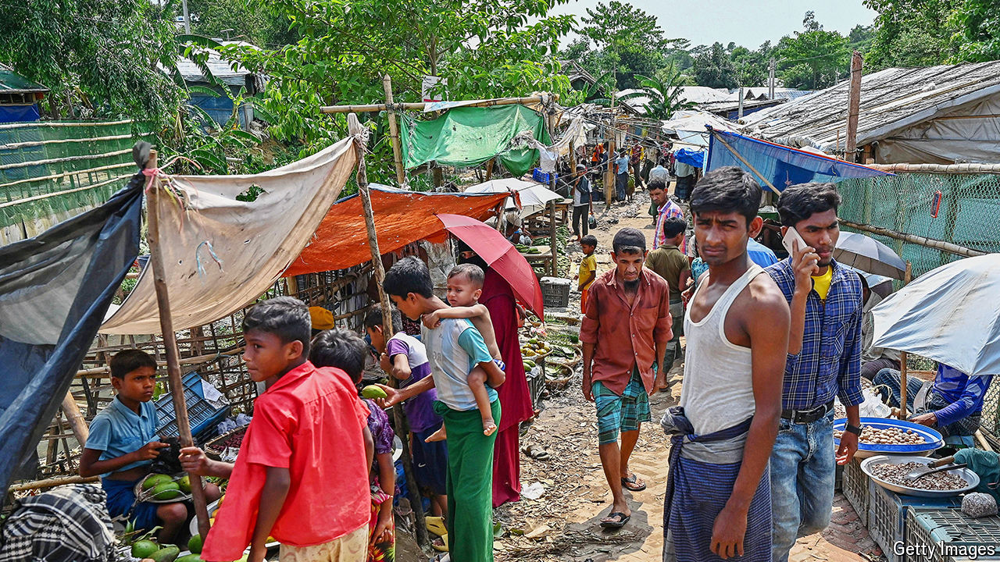

###### Old ghosts, new nightmare

# Rohingya are being forced to fight in Myanmar’s civil war 

##### The army that used to massacre them is now press-ganging them 

 

> Jun 6th 2024 

THE GUNMEN came for Abu Bakkar, a young Rohingya man, while he was hanging out with friends in the Kutupalong complex of refugee camps outside Cox’s Bazar in Bangladesh, close to the border with Myanmar. “You all have to go with us now,” they said. Out of fear, Mr Bakkar (not his real name) followed. The gunmen, he says, were members of the Rohingya Solidarity Organisation (RSO), an insurgent group that has sway in the camps. They told him he would need to “support” Myanmar’s armed forces. These are controlled by the junta that seized power in February 2021 by ousting Myanmar’s democratic government. 

Mr Bakkar is one of many Rohingya, a persecuted Muslim minority people from Myanmar’s Rakhine state, who say they are being pulled into Myanmar’s spreading civil war. As the junta has lost ground to ethnic groups challenging its control of the country, the army appears to have turned to recruiting people it once massacred in an attempt to replenish its forces. It may also be trying to stir inter-ethnic tensions to help its campaign in places such as Rakhine, where its losses have been grievous. Even where it is doing neither, Rohingya with nowhere to run are caught in the middle of a spreading civil war.

