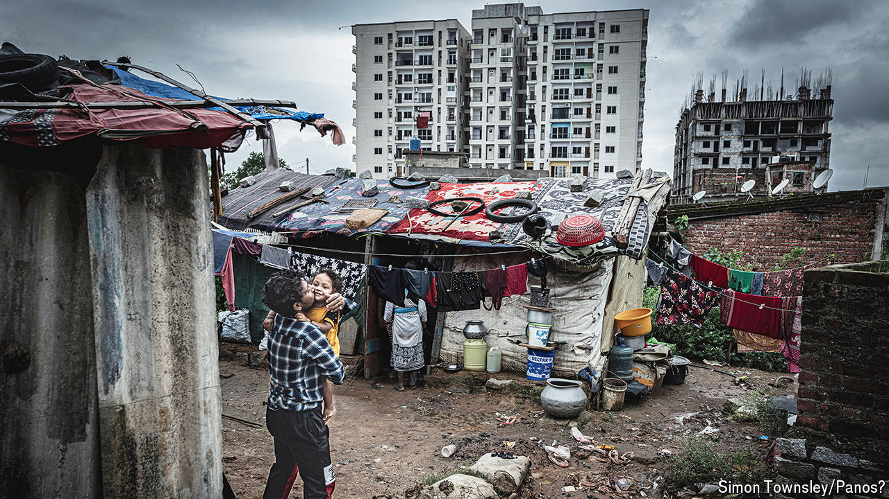

###### Two wars on want

# Will India’s new government turbocharge the fight against poverty? 

##### India and China have taken very different approaches to the problem 

 

> Jun 5th 2024 

When it won its independence in 1947, India suffered from appalling poverty. Campaigning in rural districts, Jawaharlal Nehru, the country’s first prime minister, had seen the “mark of this beast” on every brow. “Life had been crushed and distorted,” he wrote, by “continuous lack and ever-present insecurity”.

Campaigning in this year’s election, Nehru’s great-grandson, , a leader of the opposition Congress party, also addressed himself to the poor. He promised to give needy women 100,000 rupees ($1,200) a year. His party said it would double families’ monthly allotment of free grains. These “gigantic schemes of fiscal splurge”, as India’s finance minister called them, may help explain why the opposition did better in  than expected, depriving Narendra Modi, the prime minister, and his Bharatiya Janata Party (BJP) of a majority without coalition support.

