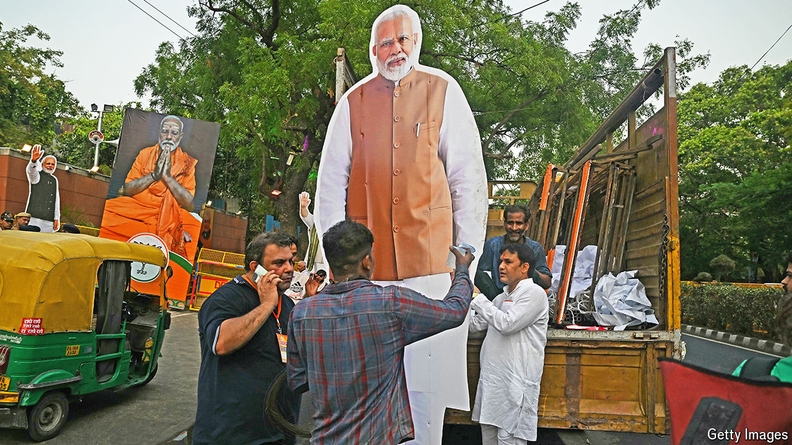

###### Electoral rebuke

# Narendra Modi could respond to disappointment in two different ways 

##### He could become more moderate and focus on the economy, or double down on Hindu nationalism 

 

> Jun 6th 2024 

The Indian voter has confounded expectations again. A decade ago, when  swept to power with an outright majority in parliament, a quarter-century of messy coalition politics came to an end. When his Bharatiya Janata Party (BJP) expanded that majority to 353 of the 543 seats in the lower house five years later, many pundits hailed the dawn of a new “dominant-party system” akin to independent India’s first three decades, when the Congress party ruled without interruption. 

Such was Mr Modi’s confidence in the build-up to this year’s general election that he set an even bigger target for the BJP and its allies this time, pledging to win 400 seats. As the voting was under way, he outlined a 1,000-year vision for India. And in late May he told a television interviewer, “God has sent me for a purpose.”

