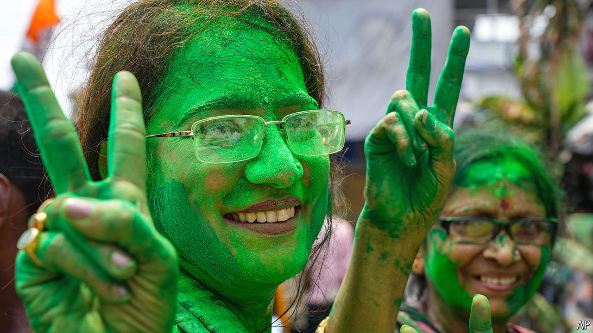
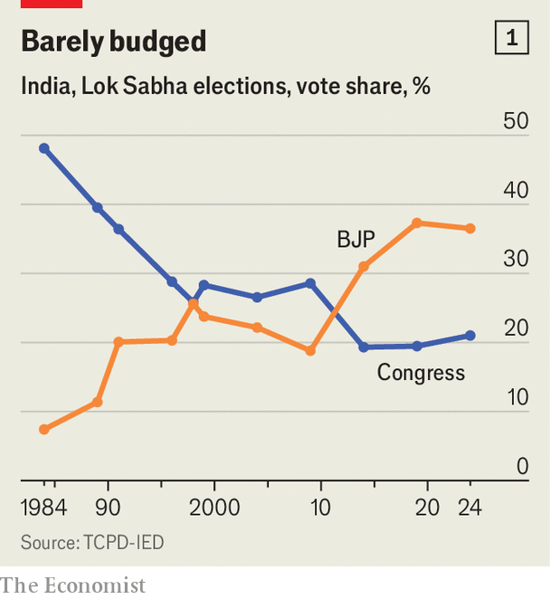

###### Anatomy of a dressing-down

# The people and places that turned away from the BJP 

##### The heartland, and especially lower-caste voters, have soured on Narendra Modi 

 

> Jun 6th 2024 

“Ab ki baar, 400 .” This time, more than 400 seats. That was the campaign slogan of the  and its allies ahead of India’s election. Yet in the end they fell far short, winning just 293. The BJP itself suffered a 63-seat loss, taking its tally from 303 to 240, below the 272 needed for a majority. Where did it all go wrong?

 


