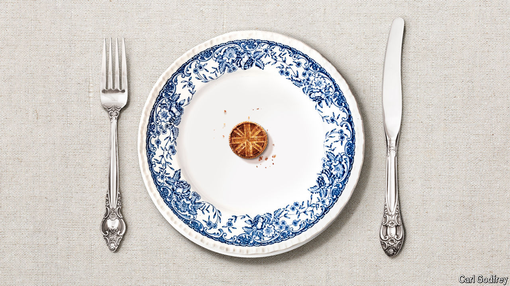

###### Slow growing

# Can Britain’s economy grow as fast as it needs to? 

##### Labour is banking on a big upswing in growth. It will struggle to get one 

 

> Jun 3rd 2024 

A fear looming over British politics in the 1960s was that France and Germany would soon surpass Britain’s economy. Today, worrywarts fret that Britain may be poorer per person than Poland within the decade. , the Labour Party leader, has voiced this concern repeatedly. Donald Tusk, the Polish prime minister, has made overtaking Britain an explicit goal. If both countries were to stay on the same per-person growth trend as in the past ten years, Poland would slip ahead of Britain in 2031. That is unlikely. But the fact that this scenario no longer looks fanciful is a reflection of Britain’s sorry recent growth record. 

Little surprise, then, that pledges to reignite growth feature heavily in the . Rishi Sunak, the prime minister, says the economy is at a turning-point and urges voters to “stick with the plan”. Labour, which is well  to win a  on July 4th, has been more explicit still. It says economic growth will be its first priority if it gets into power. The shadow chancellor of the exchequer, Rachel Reeves, has pledged to lead the most “pro-growth, pro-business Treasury our country has ever seen”. 

