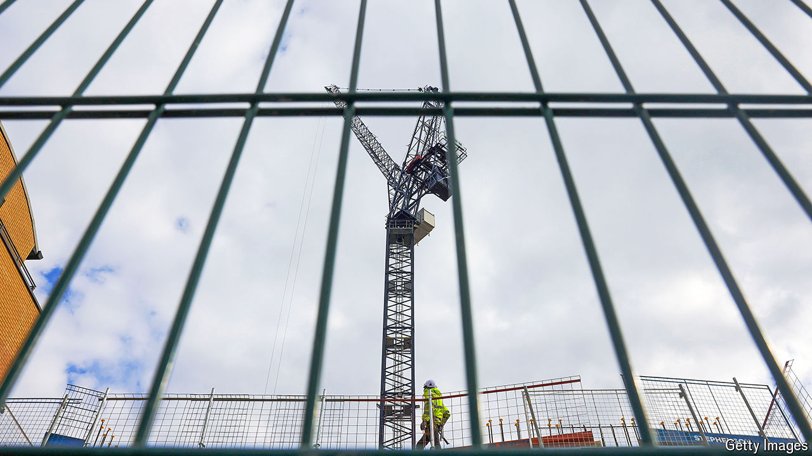

###### Building blocks

# Labour’s growth ambitions demand more radicalism on planning 

##### Small tweaks to the existing system are unlikely to deliver a big change in housebuilding 

 

> Jun 6th 2024 

At the heart of Labour’s economic strategy is a puzzle. All hope of repairing Britain’s crumbling public services is pinned on . To get it, Sir Keir Starmer, the Labour leader, says he is prepared to “bulldoze through” opposition to homes and infrastructure, largely by reforming a planning system that has become a brake on the economy. Yet for all the vigorous language, Labour’s policies are rather timid. 

The diagnosis, at least, is spot on. In Britain it has simply become too hard to build. By preventing building where it is needed, argued Rachel Reeves, the shadow chancellor of the exchequer, in a recent lecture, the planning system has pushed prices ever higher and held back Britain’s most productive cities. She described planning as “the single greatest obstacle” to economic success. 

