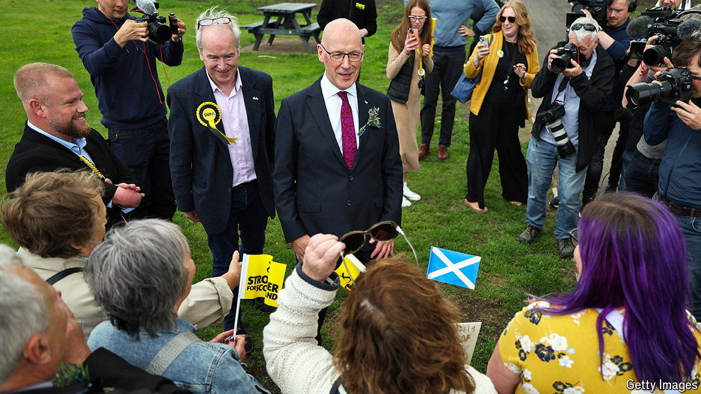

###### Tables turned

# The SNP feels the heat in Scotland’s election campaign 

##### And Labour is not the only party to see the benefits 

 

> Jun 6th 2024 

“THERE’S a lot of aggression on the doorsteps,” says Ronnie Cowan, who is running for re-election as the Scottish National Party (SNP) candidate in Inverclyde and Renfrewshire West, a constituency not far from Glasgow. The mood is worse, he says, than the past three elections he fought, than the Scottish independence referendum of 2014 and than the European Union referendum of 2016. “Previously they’d have said ‘No thank you, mate’. Now there’s effing and blinding.”

Mr Cowan blames the baleful influence of social media. But another trend also explains the abuse: the precipitous decline of the SNP’s standing among the electorate. It now trails the Labour Party by 31 percentage points to 40, according to ’s , down from a thumping lead of 47 points to 14 in January 2020. Like the Tories, it has worked through three leaders since then. Nicola Sturgeon resigned in 2023 amid a party-finance scandal; her successor, Humza Yousaf, stepped down in May to be replaced by John Swinney. Our prediction model offers a central scenario of the snp taking 24 seats in Scotland, half the number it took in 2019. 

