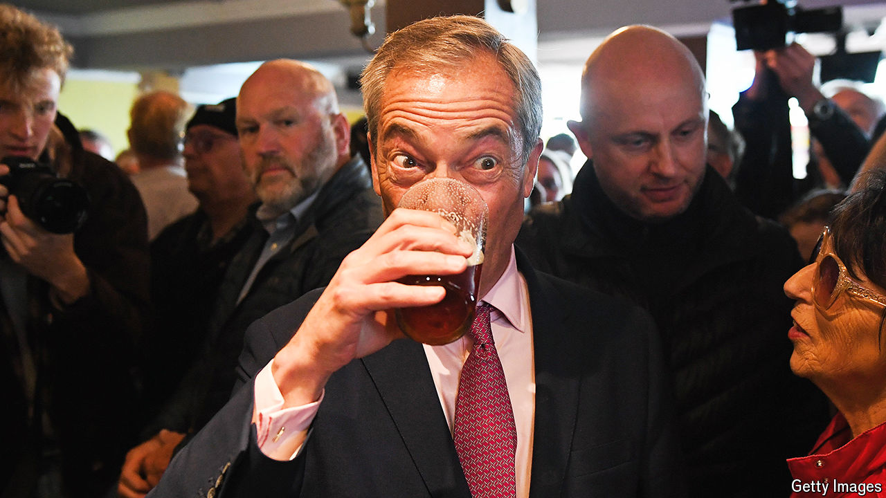

###### A seaside tradition

# The return of the Farage ratchet 

##### The Reform UK leader hopes to reshape the British political right again 

 

> Jun 6th 2024 

IT is a seaside tradition that is becoming as familiar as the Punch and Judy show. Nigel Farage goes to Clacton, a windy town on England’s east coast. The Tories panic. The policy consensus is nudged to the right. Call it the Farage ratchet. 

Mr Farage came here in 2014 to parade with Douglas Carswell, a local Tory MP who had defected to his UK Independence Party. They posed for photos at the top end of the pier by the Moon &amp; Starfish pub; Mr Carswell would win the by-election that followed. The result: David Cameron solidified his plan for a referendum on Britain’s membership of the EU. 

