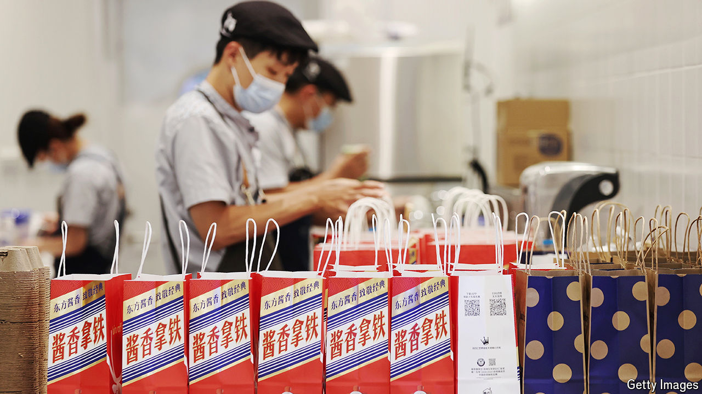

###### The taste of things to come

# Chinese fast-food insurgents are beating McDonald’s and KFC 

##### The healthy appetite comes from smaller cities 

 

> Jun 6th 2024 

WESTERN CHAINS used to dominate casual dining and drinking in China. The arrival of a Kentucky Fried Chicken in a Chinese city was once regarded as a developmental milestone. Today China is home to 10,000 KFCs (whose owner, Yum China, was spun off from its American parent in 2016), more than twice the number in America. Starbucks has 7,000 coffee shops and McDonald’s boasts 6,000 burger joints. The foreigners’ cash and cachet made it hard for locals to compete. 

Now the tables are turning. Starbucks’s Chinese sales fell by 8% in the first quarter, year on year, and Yum China reported a drop of 3%. Yet even as they lose their appetite for foreign chains, Chinese consumers cannot get enough of domestic ones. Tastien, which fills hamburgers with local delicacies such as Peking duck or mapo tofu rather than beef, has opened 1,600 new shops in the past six months, bringing its total to 7,000. Wallace, another burger-flipper, now has more than 20,000. Cotti, a two-year-old coffee-shop chain, plans to have that many by the end of 2025, up from 6,000 last October. An older caffeine-pedlar, Luckin, opened 8,000 in 2023, doubling its network. Mixue hawks its bubble tea through 36,000 outlets. 

