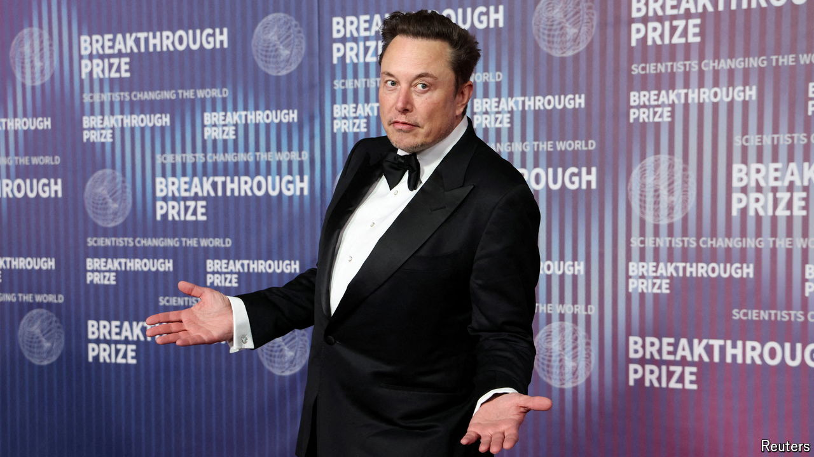
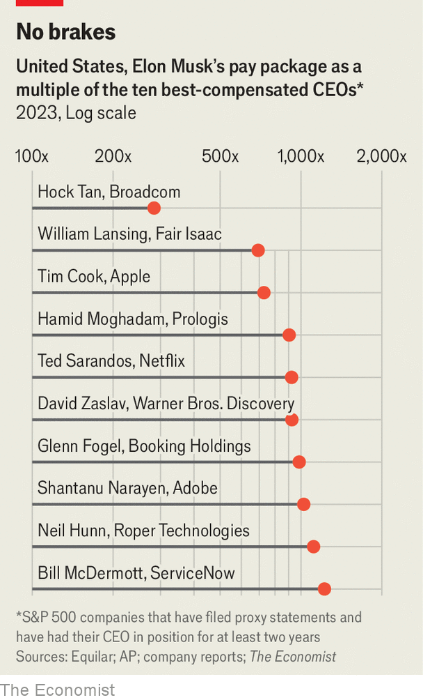

###### Premium carmaker

# Elon Musk could earn more at Tesla than other company bosses 

##### Much more 

 

> Jun 6th 2024 

 


How much is Elon Musk, the mercurial multibillionaire, worth to Tesla, the carmaker he runs? In 2018 the company’s board put in place a plan to award Mr Musk shares over ten years worth $46bn, at their current price, provided the business cleared a series of hurdles. In January a Delaware judge struck down the package, calling it “unfathomable”, after a shareholder sued to have it rescinded. The company has asked its investors to reaffirm their support for the award ahead of an annual general meeting on June 13th. Mr Musk’s monster pay package is worth nearly 300 times what America’s best-paid chief executive, Hock Tan of Broadcom, a chipmaker, made last year. It is also equivalent to 8% of Tesla’s current market value—which is down by roughly a fifth over the past year.■

