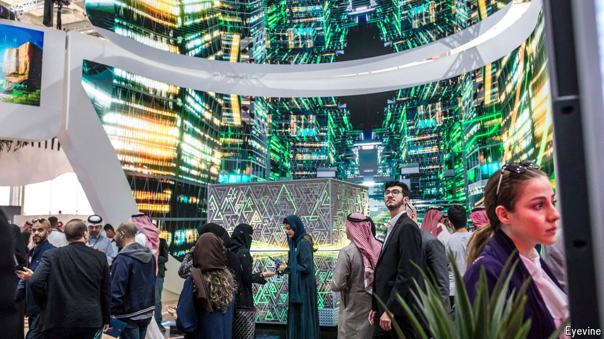

###### More than a token effort

# G42, an Emirati AI hopeful, has big plans 

##### Not all of them are narrowly commercial 

 

> Jun 6th 2024 

THE MIDDLE EAST is something of a tech desert. One company trying to change this is G42, founded six years ago in the United Arab Emirates (UAE). More recently the state-backed firm has turned into the nerve centre of Emirati ambitions to become an AI powerhouse—and to spread the country’s broader influence in its neighbourhood and beyond. But rather than creating its own large language models (LLMs) of the sort that underpin AIs like ChatGPT, G42 wants to achieve this goal by developing the infrastructure of the AI economy and the real-world applications of the technology in industries such as health care and energy.

Even by AI’s frenetic standards G42 has had a busy couple of years. It has struck deals with OpenAI, creator of ChatGPT, and with Cerebras, a chipmaking upstart, to construct a new supercomputer. It is erecting data centres to accommodate vast cloud-computing workloads. It has teamed up with AstraZeneca, a European drugmaker (to manufacture “innovative” medicines in the UAE), and with the Mercedes Formula One racing team (for reasons that are vaguer still). Through investment vehicles co-founded with Mubadala and ADQ, two Emirati sovereign-wealth funds, it is also placing multibillion-dollar bets on startups around the world. And in April it found itself on the receiving end of a $1.5bn investment from Microsoft, the $3trn software behemoth whose own partnership with OpenAI has put it at the sharp end of the AI revolution. 

