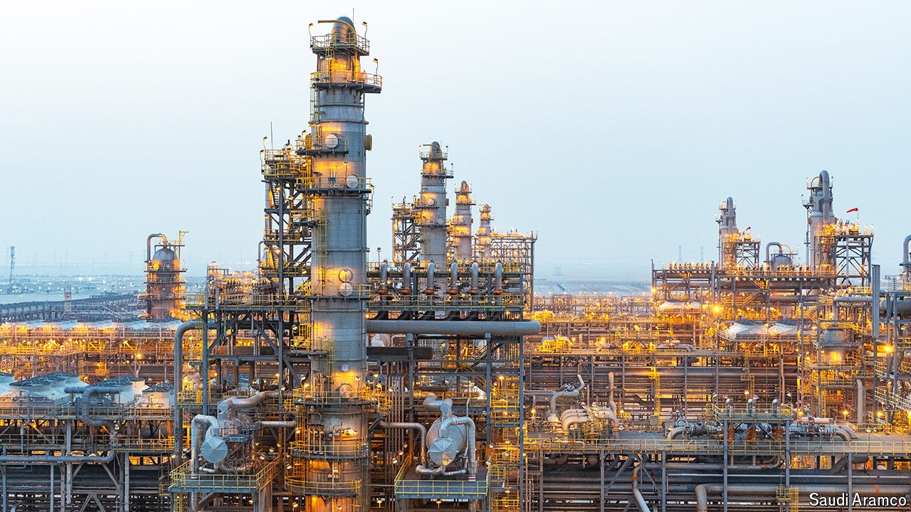
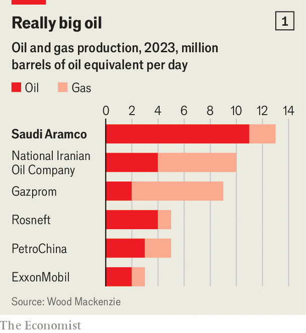

###### Beyond petroleum

# How Saudi Aramco plans to win the oil endgame 

##### The world’s biggest energy firm is the linchpin of the kingdom’s ambitions 

 

> Jun 2nd 2024 

THE MANAGERS of Saudi Aramco could have the cushiest jobs in the energy business. The oil colossus produces 11m barrels of oil a day, more than any other firm and a tenth of the world’s total (see chart 1). It boasts by far the largest proven reserves of the stuff, which would last into the second half of the century at current pumping rates. Its piddling production costs of $3 a barrel, a tenth of what many Western private-sector rivals must content themselves with, allowed it to generate an eye-watering $282bn in total net profit over the past two years. And although its oil burns as dirtily as any other, Aramco emits less carbon when liberating it from rock formations than competitors do. That makes the company’s product appealing in a world increasingly concerned about global warming but still . 

 


