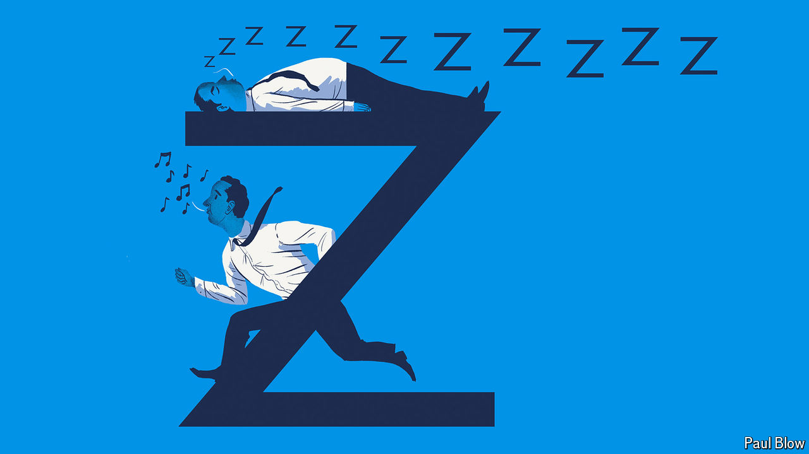

###### Bartleby

# Is it better to be an early bird or a night owl? 

##### The promise and perils of waking before sunrise 

 

> Jun 6th 2024 

Rare is the chief executive who extols the virtues of a lie-in. Tim Cook, boss of Apple, maker of the iPhone, wakes between 4am and 5am. So does Bob Iger, his counterpart at Disney, a media giant. According to one survey, two-thirds of the chief executives of large American companies are up by 6 o’clock; for average Americans the share is less than one in three. For those aspiring to corporate greatness, the message seems clear: you snooze, you lose.

Your guest Bartleby harbours no such ambitions. But he has, in the past, experimented with early starts, and can confirm that their benefits go beyond the smug sense of satisfaction that comes from arriving at your desk before your editor. Inboxes can be cleared and tricky problems mulled over before the onslaught of emails and meetings begins, leaving you feeling well prepared for the day ahead.

