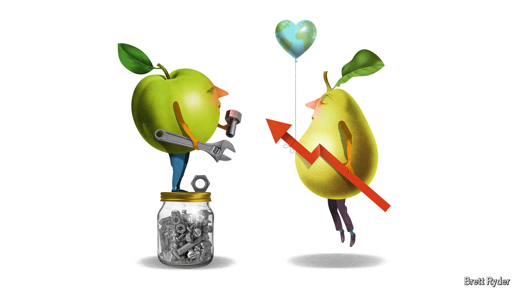

###### Schumpeter

# Lessons in capitalism from Whole Foods and Trader Joe’s 

##### How to build businesses that last 

 

> Jun 6th 2024 

America is not just the land of red-blooded capitalism. It has an esoteric tradition of capitalist altruism, too. Take Trader Joe’s, an own-label grocery chain like M&amp;S in Britain. It somehow retains a local-community feel, like an indoor farmers’ market with good prices and wonderful staff, despite having 549 stores. Whole Foods Market, a 530-store Mecca for well-heeled health nuts and epicureans, has a similar vibe. Or at least it did until 2017, when it was sold to Amazon for $13.7bn. Its co-founder, John Mackey, has recently published a book full of  about his 42 years at its helm. “The Whole Story: Adventures in Love, Life and Capitalism” comes a few years after an even quirkier memoir by the founder of Trader Joe’s, the late Joe Coulombe. They are strikingly different characters who approached retailing in unusual ways. Each offers good lessons in entrepreneurship. 

Mr Mackey’s book starts with him as a college dropout having an LSD-fuelled epiphany: “I was IT. And it was me, and I was there. And it was ALL.” Don’t be put off. Whether or not would-be entrepreneurs should drop acid for inspiration, in his case it worked. The Texan’s quest for self-discovery leads to a new philosophy of natural-food retailing that conquers America. Coulombe’s book, “Becoming Trader Joe”, has no New Ageiness, even though his chain started in California in 1967. As a lesson in how to beat the big guys in business, it does exactly what it says on the tin. His first anecdote is about the merits of relabelling Peruvian tuna as pilchards to avoid import quotas and cut prices. 

