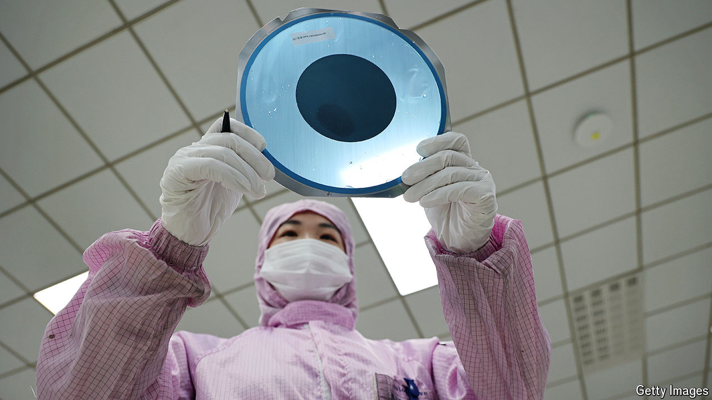

###### Castles made of silicon

# Should the world fear China’s chipmaking binge? 

##### Concerns that cheap Chinese semiconductors will flood the market may be premature 

 

> Jun 6th 2024 

CHINA’S HUNGER for homemade chips is insatiable. In May it was revealed that the government had launched the third iteration of its “Big Fund”, an investment vehicle designed to shore up the domestic semiconductor industry. The $48bn cash infusion is aimed at expanding the manufacture of microprocessors. Its generosity roughly matches similar packages from America ($53bn) and the EU ($49bn), both of which are also trying to encourage the expansion of local chipmaking.

Chinese chipmakers are in a tough spot. In October 2022 America’s government restricted the export to China of advanced chips and chipmaking gear made using American intellectual property—which is to say virtually all such devices. This makes it near-impossible for Chinese firms to produce leading-edge microprocessors, the kind whose transistors measure a few nanometres (billionths of a metre) across and which power the latest artificial-intelligence models. But it does not stop them cranking out less advanced chips, with transistor sizes measured in tens of nanometres, of the sort that are needed in everything from televisions and thermostats to refrigerators and cars. 

