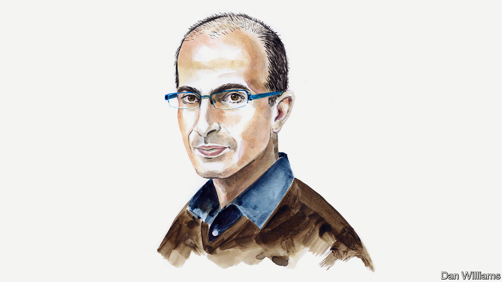

###### Putin, the West and the rest

# Yuval Noah Harari on how to prevent a new age of imperialism 

##### Non-Western powers have a stake in bringing peace to Ukraine, argues the historian 

 

> Jun 3rd 2024 

WE FULLY APPRECIATE our knees only when they stop working. The same is true of the global order: its former benefits become apparent only as it collapses. And when order collapses, the weak usually suffer most. This law of history should be on the minds of world leaders in the run-up to the Ukraine peace summit in Switzerland on June 15th. If peace cannot be restored and the international rules-based order continues to unravel, the catastrophic results will be felt globally.

Whenever international rules become meaningless, countries naturally seek safety in armaments and military alliances. Given events in Ukraine, can anyone blame Poland for almost doubling its army and military budget, Finland for joining NATO or Saudi Arabia for pursuing a defence treaty with the United States? 

