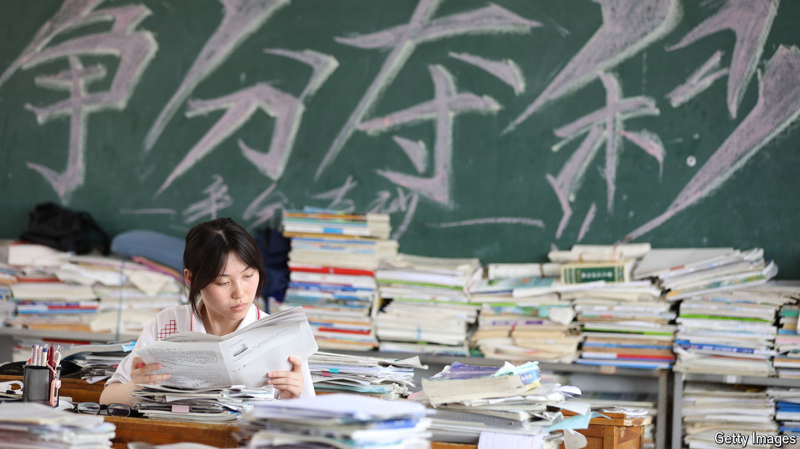

###### Scoring political points

# Changes to China’s gaokao exam are about politics, not fairness 

##### Extra points for minority students are going away 

 

> Jun 6th 2024 

Starting on June 7th millions of young people will sit for the world’s largest academic test. China’s university-entrance exam, known as the , is punishingly difficult. Students spend endless hours cramming for it. But it is also meant to be meritocratic. Work hard, score well and, no matter what your social background, you can get into a good college. 

Yet the test is administered in ways that do not seem so meritocratic. Local governments are allowed to produce their own versions of the , with different questions and scoring methods. Students in elite cities, such as Beijing and Shanghai, enjoy an easier route into local universities, which include some of the country’s finest.

