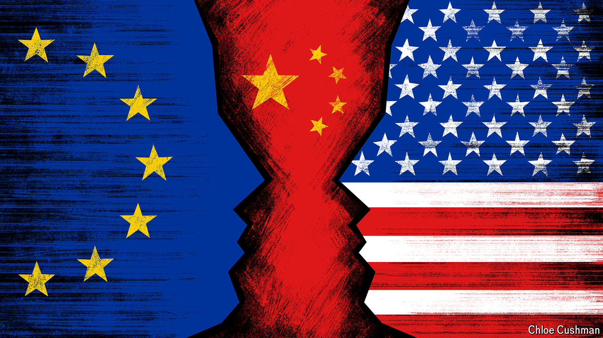

###### Chaguan

# China unites America and Europe in alarm 

##### But they don’t agree on the solution 

 

> Jun 6th 2024 

REMINDERS OF a wicked world are multiplying at the Arvfurstens Palace in Stockholm, stately seat of Sweden’s foreign ministry. A bronze briefcase, bearing the initials RW, has for some years stood outside the front door. It honours Raoul Wallenberg, a young diplomat who used his country’s profitable—and at times shameful—tradition of neutrality to save thousands of Jews in Nazi-occupied Hungary with Swedish “protection passes” he had crafted, before he vanished into the prisons of the Soviet Union. Of late, four large flags also adorn the stone-floored entrance hall. Three reflect Sweden’s proud self-image as a champion of free trade, development aid and international co-operation. These are the Swedish flag, the flag of the European Union and the United Nations standard. The fourth is new: the flag of NATO, the defence alliance that Sweden joined in March. The country was jolted out of 200 years of neutrality by Russia’s invasion of Ukraine.

Russian aggression led Sweden (preceded by Finland, which joined NATO a few months earlier) to bind its security, formally, to that of the American-led West. Sweden’s resolve, and that of like-minded European governments, has been strengthened by what China did next. In late May Chaguan attended the Stockholm China Forum, a closed-door meeting of American and European officials, business executives and analysts, as well as Chinese scholars. Your columnist has attended these forums since 2008. This one stood out for a convergence of views over the challenge that China poses to the global security and economic order.

