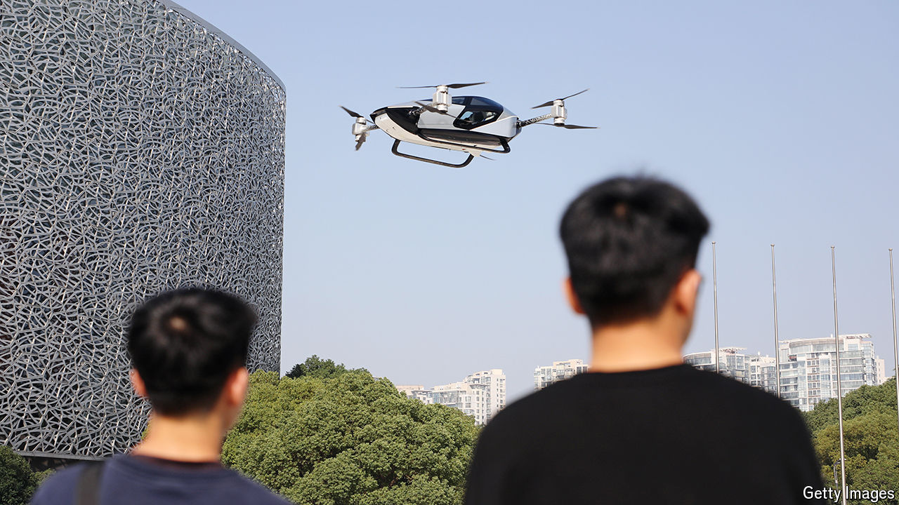

###### Low altitude, high ambitions

# It’s a bird, it’s a plane…it’s a Chinese flying car 

##### China is developing the vehicles faster than any other country 

 

> Jun 6th 2024 

IN HIS state-of-the-nation address earlier this year, China’s prime minister, Li Qiang, spoke of fostering new engines of economic growth. In particular, he mentioned “the low-altitude economy”. The phrase conjures images of flying cars, which might seem like science fiction to some. But in this area China is moving faster than most countries. Makers of flying cars, or electric vertical take-off and landing (eVTOL) vehicles, have been getting the green light from the government.

The vehicles often look like very big consumer drones. Some are designed to be autonomous, meaning no pilot is needed. One model, the EH216-S made by EHang, a company in Guangdong province, was awarded a “production certificate” in April by the Civil Aviation Administration of China (CAAC). That allows the firm to start mass production. The EH216-S is the first flying car to receive such regulatory approval anywhere in the world. 

